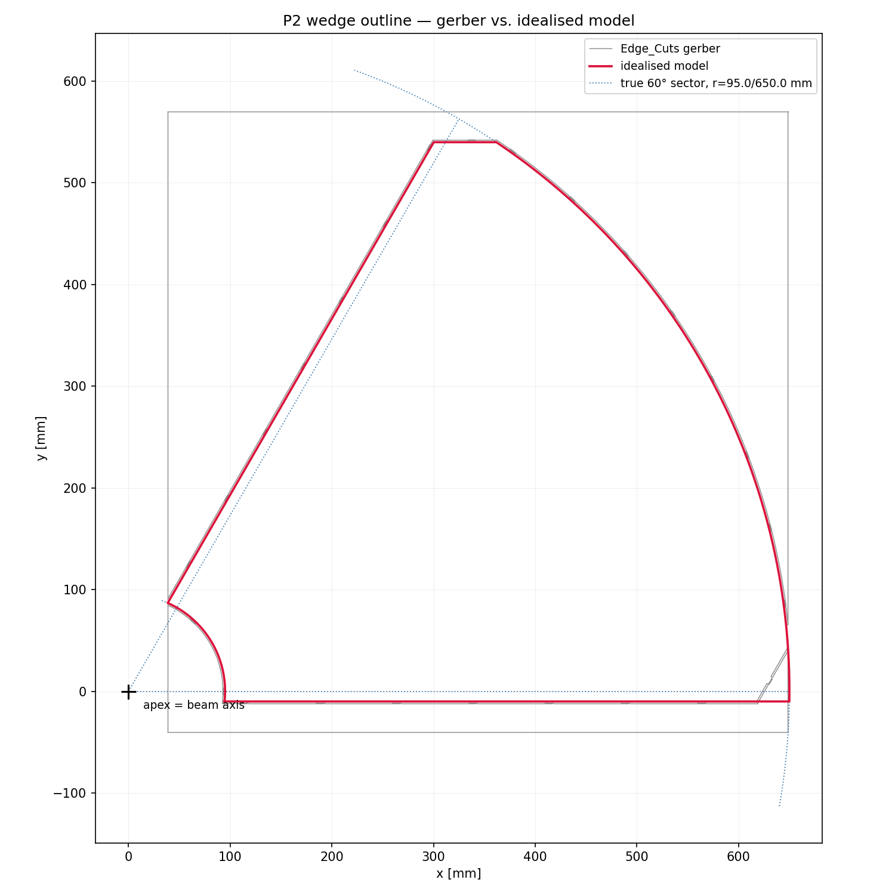
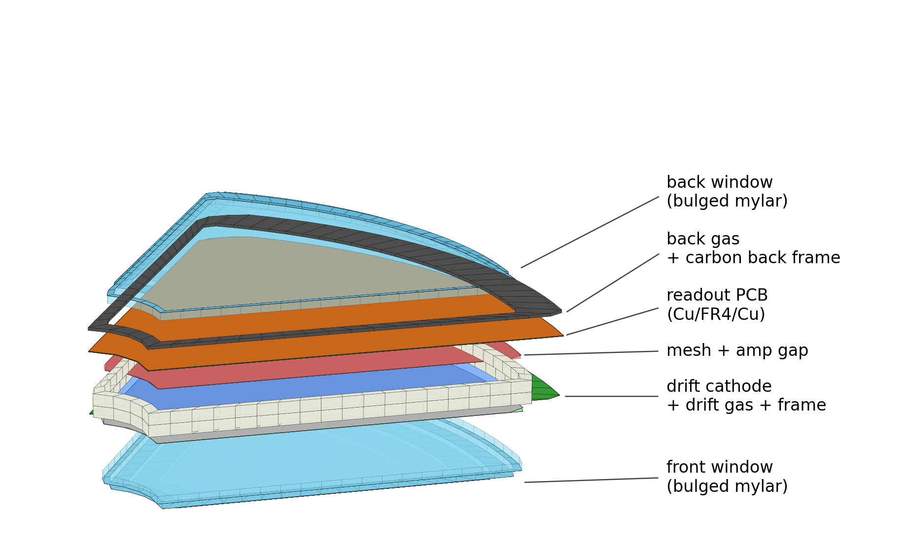

# P2 Micromegas Simulation

Geant4 simulation of the P2 wedge Micromegas detector (MESA / Mainz).

> **Read [`docs/HANDOFF.md`](docs/HANDOFF.md) first.**
>
> **Update 2026-08-06: VMM analysis re-scoped for a *pad* detector, and a
> first time-resolution prediction exists.** The charge cloud fires **~1.1
> pads on average**, so inter-pad clustering is a ~10 % minority effect;
> **VMM neighbor logic** — a strip-detector feature — reads *chip-channel*
> neighbors, which on this pad plane are physical neighbors only 74 % of the
> time in one mapping revision and **7.7 %** in the other (median partner
> distance 12 mm vs **126 mm**). Baseline is therefore **NL off**, with
> clustering done offline on geometric adjacency
> ([`vmm/nl_map.py`](vmm/nl_map.py)). Separately, we now predict a per-pad
> time resolution of **≈ 10–13 ns (Ar mixes) / 15–25 ns (Ne mixes)**,
> dominated entirely by primary-ionization statistics — the number to compare
> against the SPS run
> ([`docs/research/TIME_RESOLUTION_NOTES.md`](docs/research/TIME_RESOLUTION_NOTES.md),
> [`vmm/time_resolution.py`](vmm/time_resolution.py)). Also corrected: the
> "two mapping revisions disagree on 79/1280 pads" claim was a rounding
> artifact — the pad planes are identical to 2.5 µm; the revisions disagree
> on the **readout order** (11/1280 channels agree), which is what matters.
>
> **Update 2026-08-05 (night): it builds and runs.** First working P2
> simulation on lxplus — geometry passes overlap checks, and three bugs were
> fixed getting there (two fatal: self-intersecting `WedgeOutline` polygons
> that killed `G4ExtrudedSolid`, and a ROOT thread-safety race that
> core-dumped every multi-threaded run). Output now carries **full
> provenance**: every gas cluster knows the process, layer, position and
> energy of the interaction that started its chain, and every volume that
> receives energy is scored. The **P0.1 gas-composition bug is fixed** too (volume-vs-mass
> fractions *and* STP-vs-20 °C densities — see
> [`docs/research/GAS_FIX_NOTES.md`](docs/research/GAS_FIX_NOTES.md)).
> First physics, measured with the corrected gas: **90 % of photon-induced
> gas signals originate in the mesh and the copper pad plane**, not in the
> gas, and switching argon → neon removes only **(12 ± 3) %** of them —
> confirming the analysis below. Speed and
> campaign cost: [`docs/BENCHMARKS.md`](docs/BENCHMARKS.md). Biggest
> remaining unknown: [`docs/NEEDED_INPUTS.md`](docs/NEEDED_INPUTS.md).
>
> **Update 2026-08-05 (late): the gas premise changed.** The expected photon
> background is **50–100 keV** (plus a harder tail), well above the Ar
> K-edge. An analytic pass
> ([`docs/research/PHOTON_DISCRIMINATION_NOTES.md`](docs/research/PHOTON_DISCRIMINATION_NOTES.md),
> reproducible via `python3 scripts/photon_budget.py`) finds that (a) Ar vs
> Ne interaction probability differs by only 5.4×→2.1× across the band, and
> (b) **conversions in the mesh and copper pad plane outnumber gas
> conversions by 15–65×**, a gas-independent floor. Net: Ar/Iso and Ne/Iso
> total fake sources differ by under 10 %, while neon costs a 30× worse
> zero-cluster floor — so **argon is now a co-baseline, not the incumbent to
> beat**. The **energy-deposition discrimination** handle (MIP Landau vs
> Compton/photoelectric deposits) is real at 3–30× MIP but its target is the
> minority population. Campaign plan amended throughout; new Phase-0 items
> P0.12 (per-event interaction classification), P0.13 (mesh cross-check)
> and a γ-production-cut bug suppressing Cu-K fluorescence — **all three
> now implemented and verified, see the update above.**
>
> **Update 2026-08-05 (evening):** the simulation **campaign is now planned**
> — [`docs/SIM_CAMPAIGN_PLAN.md`](docs/SIM_CAMPAIGN_PLAN.md) is the working
> document (phases, run matrices, gas candidate list, chain architecture),
> backed by two sourced research notes in
> [`docs/research/`](docs/research/). The **VMM3a electronics emulator is
> implemented and unit-tested** in [`vmm/`](vmm/README.md). Execution is
> **gated on Alexandra's geometry review**; the plan's Phase 0 lists prep
> tasks that are safe now — first among them the **gas-mixture
> mass/volume-fraction bug fix (P0.1)**, which must land before any Ar-vs-Ne
> comparison.
>
> **Update 2026-08-05:** the P2 wedge geometry is now implemented as a new
> `p2` mode (the default) — full stack in gerber coordinates: readout PCB
> (18 µm Cu / 200 µm FR4 / 18 µm Cu), amp gap, woven mesh (48/19 µm, as an
> effective-density slab), drift gap, two-foil drift cathode (1 mm apart, Al
> on the gas side), gas frame, carbon back frame (1 mm) and mylar sheets with
> the overpressure bulge of the outer two modelled as terraced domes.
> **Several dimensions are still educated guesses —
> [`docs/P2_MODEL.md`](docs/P2_MODEL.md) is the list of what is measured vs.
> assumed and what to confirm.** Not yet compiled or validated on lxplus.
> The other modes are inherited MX17 and untouched.

## Layout

| Path | What |
|---|---|
| `mm_sim.cc`, `src/`, `include/` | Geant4 application — `p2` mode (default) + inherited MX17 modes |
| `scripts/model/` | Python mirror of the P2 geometry + figure generation |
| `docs/SIM_CAMPAIGN_PLAN.md` | **THE campaign plan**: phases P0–4, run matrices, gas list, chain architecture, bookkeeping |
| `docs/research/` | sourced research notes: `TOOLCHAIN_NOTES.md` (Geant4/Garfield++/Magboltz/Heed/VMM), `GAS_NOTES.md` (Ne mixtures, flammability, procurement), **`PHOTON_DISCRIMINATION_NOTES.md` (50–100 keV cross-sections, edep discrimination, wall-conversion floor, edep→ADC proportionality)**, `TIMING_PSD_NOTES.md` (time-structure handle), **`TIME_RESOLUTION_NOTES.md` (predicted σ_t per pad, contribution budget, SPS comparison protocol)** |
| `scripts/photon_budget.py` | analytic photon-interaction budget — the numbers the Geant4 photon runs must reproduce |
| `docs/NEEDED_INPUTS.md` | **register of what we are guessing** — spatial/angular distributions, spectra, geometry, noise |
| `docs/BENCHMARKS.md` | measured speed on lxplus + campaign cost estimate |
| `docs/OUTPUT_FORMAT.md` | ROOT/CSV schema: EventTree, ClusterTree provenance, VolumeTree |
| `vmm/` | **VMM3a electronics emulator** (Athena shaper port + pad digitizer, unit-tested), **pad/channel adjacency map (`nl_map.py`)** and the **time-resolution toy (`time_resolution.py`)** — see `vmm/README.md` |
| `docs/P2_MODEL.md` | **as-built model, assumptions, open questions** |
| `docs/P2_EXPERIMENT.md` | P2@MESA / BASKET physics context, kinematics, rates (sourced) |
| `docs/SIM_CAMPAIGN_BRIEF.md` | campaign handoff snapshot (capabilities/assumptions; plan now in SIM_CAMPAIGN_PLAN.md) |
| `macros/`, `scripts/`, `ls_calibration/`, `sr90_calibration/` | build, HTCondor submission and analysis, inherited from MX17 |
| `design/` | P2 fabrication data: gerbers, drill, bulk masks, channel mapping, drift frame — see [`design/README.md`](design/README.md) |
| `scripts/gerber/` | gerber parsing and geometry extraction tools |
| `docs/P2_GEOMETRY.md` | **every P2 dimension, with its source** |
| `docs/HANDOFF.md` | state of play, plan, and open questions |
| `docs/MX17_README.md` | the original MX17 README (modes, CLI, output format) |

## The detector in one table

Measured from the fabrication files (see `docs/P2_GEOMETRY.md`):

| | |
|---|---|
| Shape | 60° annular sector, apex on the beam axis |
| Board | r = 95 → 650 mm, radial edges offset +10 mm, top cut at y = 540 mm |
| Active area | r = 120 → 590 mm, φ = 0.97° → 59.0°, ≈ 1689 cm² |
| Readout | 1280 pads = 10 connectors × 128 ch; 42 rings, 11.43 mm radial pitch |
| Pad cell | ≈ 11.43 × 11.86 mm (area-equalized) |
| Pillars | Ø0.5 mm on a 2.000 mm pitch, 41 366 of them |
| Readout PCB | 2-layer, 0.236 mm (18 µm Cu / 200 µm FR4 / 18 µm Cu) |
| Drift gap | 3 mm confirmed baseline (campaign scans 1–4 mm; two frame variants exist) |



## Running the P2 simulation

```bash
./build/mm_sim -n 10000                     # p2 mode, ArIso, 155 MeV e-, aimed mid-wedge
./build/mm_sim --drift-gap 4 -g ArCO2       # 4 mm frame variant, different gas
./build/mm_sim --gun-x 150 --gun-y 30       # aim near the inner radius
python scripts/model/plot_p2_model.py       # geometry figures -> docs/figures/
```



## Gerber tools

```bash
# wedge outline parameters + comparison figure against the gerber
python scripts/gerber/p2_wedge_model.py --out wedge.png

# readout pad map (also cross-checks the two mapping revisions)
python scripts/gerber/analyze_p2_readout.py --plot padmap.png

# full geometry dump for any gerber set
python scripts/gerber/analyze_p2_geometry.py
python scripts/gerber/analyze_p2_geometry.py --dir design/gerbers/RKP2_10x10/Gerber
```

`scripts/gerber/gerber_outline.py` is a small standalone RS-274X reader (no
external gerber library needed); the analysis scripts need numpy and matplotlib.

## Building (inherited from MX17, unchanged)

```bash
source scripts/setup_lxplus.sh   # Geant4 11.2 + ROOT 6.30 from CVMFS
bash scripts/build.sh            # -> build/mm_sim
```

The command-line interface, simulation modes and output format are documented in
[`docs/MX17_README.md`](docs/MX17_README.md) and still apply to the code as it
stands.
