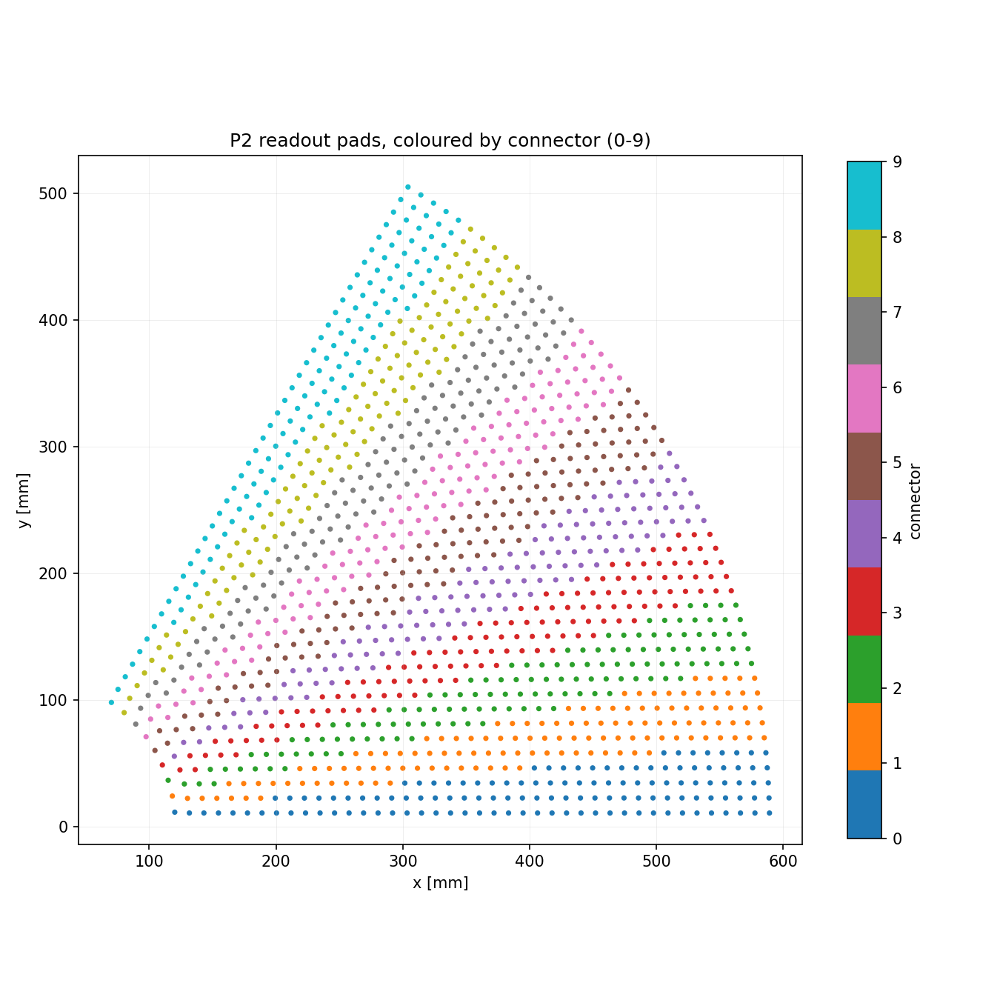

# P2 wedge geometry — extracted from the fabrication gerbers

Everything below was measured directly out of the files in `design/`, not taken
from a drawing or a note. Each number says where it came from, so it can be
re-derived or challenged. Regenerate with:

```bash
python scripts/gerber/p2_wedge_model.py       --out docs/figures/p2_wedge_outline.png
python scripts/gerber/analyze_p2_readout.py   --plot docs/figures/p2_readout_padmap.png
python scripts/gerber/analyze_p2_geometry.py                 # full dump

# The pad copper the Geant4 geometry is built from -> include/P2PadMap.hh
python scripts/gerber/extract_readout_pattern.py --write --compare
```


---

## 1. Board outline

Source: `design/gerbers/P2_BASKET_Apr26/Gerber/P2_BASKET-Edge_Cuts.gbr`
(KiCad 9.0.2, generated 2026-01-20, project `P2_BASKET`).

The gerber origin **is the wedge apex, i.e. the MESA beam axis** — every arc in
the profile fits a circle centred within 0.35 mm of (0, 0).

| Quantity | Value | How it was measured |
|---|---|---|
| Apex | gerber (0, 0) | arc-centre fits, all within 0.35 mm of origin |
| Inner radius | **95.0 mm** | arcs at r = 95.010, 95.015 (board edge) |
| Outer radius | **650.0 mm** | arcs at r = 649.84 … 650.05 (board edge) |
| Nominal sector | **60°** (φ = 0 … 60) | the two straight-edge families are at 0.00° and 60.00° |
| Radial edges offset | **+10.0 mm outward** | perpendicular distance of both edge families from the origin = 9.996–10.007 mm |
| Top chord cut | **y ≤ 540.01 mm** | horizontal line at y = 540.010/540.028 |
| Radial extent | 555.0 mm | 650 − 95 |
| Board area | ≈ 2267 cm² | polygon integration of the model |

Because the two radial edges are pushed 10 mm *outward*, the board is a little
wider than a true 60° sector, and the arcs run past the nominal φ limits:

- inner arc spans φ = **−6.042° … +66.042°** (72.085°)
- outer arc spans φ = **−0.882° … +60.882°** (61.763°), truncated by the top cut
  at φ = 56.16° (x = 361.8 mm)

The idealised model in `scripts/gerber/p2_wedge_model.py` reproduces the gerber
profile everywhere on the figure above. The only deviation is a small chamfer on
the bottom-right corner that the model does not carry.

**Not part of the detector:** the outline file also contains a 610 × 610 mm
fabrication panel (x 38.594…648.595, y −39.996…570.004) and a 2.0 mm routing
channel with mouse-bite tabs separating board from panel. Ignore both when
building the Geant4 solid — the second, offset copy of every edge you see in the
raw gerber is the far side of that routing channel.

### Building this in Geant4

Three options, in increasing fidelity:

1. **`G4Tubs`** — `rmin=95, rmax=650, sphi=-0.882°, dphi=61.763°`. Ignores the
   10 mm edge offset (≤ 10 mm error on a 555 mm radial arm) and the top cut.
   Fine for a first material-budget pass.
2. **`G4IntersectionSolid`** of that `G4Tubs` with a prism bounding the two
   offset half-planes and `y ≤ 540.01`. Exact, but three booleans deep.
3. **`G4ExtrudedSolid`** built from `p2_wedge_model.outline()` — exact and
   cheap to navigate. Dump the polygon to a header and extrude each layer.
   This is the recommended route since every layer of the stack shares one
   profile.

---

## 2. Active area (bulk Micromegas)

Source: `design/gerbers/bulk_masks_CERN/P2_Mask2.gbr` (Ucamco UcamX, 2026-05-13)
— the CERN bulk pillar mask.

| Quantity | Value |
|---|---|
| Pillar diameter | **0.5 mm** (aperture D13, circle) |
| Pillar pitch | **2.000 mm**, exact — nearest-neighbour distance is 2.0000 mm in every sampled window |
| Pillar count | **41 366** |
| Active radius | **119.87 … 589.80 mm** |
| Active azimuth | **0.974° … 59.002°** |
| Active area | ≈ 1689 cm² |

`P2_Mask1.gbr` is the companion mask; its bounding box is
x 38.60…648.57, y −10.00…540.01 mm — an independent confirmation of both the
board outline *and* the y ≤ 540.01 top cut derived above.

Older revisions of the same two masks are in
`design/gerbers/bulk_masks_CERN/older_revisions/` (V1, V2).

Pillar coverage is 41 366 × π(0.25)² = 81.2 cm² out of 1689 cm², i.e. **4.8 % of
the amplification gap is pillar rather than gas** — worth folding into the
effective gas thickness if the amplification region is scored.

---

## 3. Readout pads

Sources: `design/mapping/connector_*.txt` and `design/mapping/Mapping/connector_*.txt`,
cross-checked against `design/gerbers/P2_BASKET_Apr26/Gerber/P2_BASKET-F_Cu.gbr`.



| Quantity | Value |
|---|---|
| Channels | **1280 pads** = 10 connectors × 128 channels |
| Radius range | 120.714 … 589.286 mm (pad *centres*, mapping files) |
| Azimuth range | 1.0695° … 58.9304° |
| Radial rings | **42**, pitch **11.429 mm** (constant to 1 µm) |
| Pads per ring | 9 (inner) → 51 (outer) |
| Azimuthal arc pitch | ≈ 11.9 mm at every radius (12.9 mm on the innermost ring) |
| Pad cell | ≈ **11.43 mm × 11.86 mm**, i.e. area-equalized |

### The copper itself (2026-08-07)

The mapping files give pad *centres*; the copper geometry comes from the
`F_Cu` gerber, where all 1280 pads are G36 regions. Extracted and checked
feature-by-feature by `scripts/gerber/extract_readout_pattern.py`, which
writes the table the Geant4 geometry is built from
(`include/P2PadMap.hh`):

| Quantity | Value | Note |
|---|---|---|
| Ring radial pitch | **11.428605 mm** | max deviation of any ring from the fitted line: 0.5 µm |
| Pad radial height | **11.30170 mm** | spread across all 1280 pads: 0.48 µm |
| Radial gap between rings | **0.12691 mm** | |
| Azimuthal gap between pads | **0.122 … 0.127 mm** | grows slightly with radius |
| φ pitch uniformity within a ring | **6 × 10⁻⁶ rad** | i.e. exact at the gerber's 1 nm coordinate resolution |
| Pad shape | true annular sector | polygon area = 0.9997 × r·Δφ·Δr, so a `G4Tubs` segment is not an approximation |
| Total pad copper | **1697.15 cm²** | over a 1715.89 cm² replica envelope = 0.9891; × the radial-gap factor = **0.9781** of the pad-field annulus |

**The grid is exactly regular, so it is cheap to build as real geometry.**
Each ring is one `G4PVReplica` in φ: 3 logical volumes per ring, 126 for all
1280 pads, and the navigator finds a pad by index arithmetic rather than by
searching a daughter list. See `DetectorConstruction::ConstructP2`.

> **The mapping radii sit ~65–80 µm outside the gerber pad mid-radius.**
> `120.714 + n·11.4290` (mapping) vs `120.6494 + n·11.428605` (gerber pad
> polygons). Both the offset and the pitch differ slightly. For anything
> touching copper the gerber is the authority — it *is* the artwork. The
> difference is 0.6 % of a pad and does not matter for choosing an aim point.

> **The default beam aim point lands in an inter-pad gap.** `SimConfig`'s
> (302.49, 174.64) = r 349.284 mm, φ = 30.000° was chosen as a *ring centre*
> to avoid a radial pad boundary — and it is one, to 62 µm. But at exactly
> 30° it falls **61 µm from the centre of the 126 µm azimuthal gap** between
> pads 14 and 15 of ring 20. Confirmed in simulation: a pencil muon beam
> there puts energy into pad copper in only **25 %** of events, versus 100 %
> at a pad centre. A pad centre in *both* coordinates is
> **(305.385, 169.399)** — r 349.2215 mm, φ 29.0174°. The aim point has to be
> chosen against the φ grid as well as the radial one.

> **Units trap:** the `Phi` column in both mapping files is in **radians**,
> even though it sits next to a `Radius` in mm and the header gives no unit.
> Verified by `atan2(Y, X)` against the `X`/`Y` columns in the 9-column files.
> The `DeltaPhi` column is likewise radians.

Each connector owns a ~6° azimuthal slice (see figure). Connector/channel
ordering is described in `design/mapping/README` (in French): channel and pad
indices run counter-clockwise, but `PadIndex` reverses direction for connectors
5–9.

> **The two mapping files agree on the pads and disagree on the channels**
> (2026-08-06). All 1280 pad positions match to 2.5 µm, so every geometric
> number in this section is revision-independent. But only **11/1280
> (connector, channel) pairs land on the same pad**: the 9-column file steps
> mostly along a ring (68 % azimuthal, 32 % radial, consecutive channels a
> median 11.9 mm apart), while the 7-column file interleaves radial columns
> (consecutive channels a median **126 mm** apart). Anything channel-level —
> VMM neighbour logic above all — depends on which one is real.
> `python3 vmm/nl_map.py` prints the full comparison.

### Copper coverage — corrected 2026-08-07

> **`B_Cu` is not a ground plane.** An earlier revision of this section said
> it was "a single solid ground plane spanning r = 95.09…649.91 mm over the
> full wedge". That is the *bounding box* of one large stitched region, not a
> plane. `B_Cu` is **30 805 stroked 0.125 mm signal traces** plus 2 × 1280
> Ø0.8 mm via pads, covering ~18 % of the board. This matches what the
> collaboration said (Alexandra, 2026-08-05: signal lines, not a plane) and
> the docstring of `analyze_cu_coverage.py`; only this file was wrong. The
> model input `p2_bcu_coverage = 0.174` was never affected.

> **`p2_fcu_coverage = 0.983` was wrong and is no longer used.**
> `analyze_cu_coverage.py` buffered every non-rectangular flash as a disc of
> radius `ApertureDef.size / 2`, and `size` is `max(params)` — which for
> KiCad's `RotRect` macro apertures is the **rotation angle in degrees**
> (`%ADD19RotRect,0.300000X1.800000X302.763000*%`). That painted a ~151 mm-radius
> disc at each of the 1420 connector-pin flashes on `F_Cu`. Apertures tagged
> `NonConductor` and `Profile` were counted as copper too. Fixed in that
> script; the geometry now takes its numbers from
> `extract_readout_pattern.py` instead.

Corrected coverages, from the exact vector geometry:

| zone | area | F.Cu | B.Cu |
|---|---|---|---|
| inner margin, r 95 … 115 mm | 26.0 cm² | 0.123 | 0.123 |
| pad field, r 115 … 594.9 mm | 1879.6 cm² | 0.913 | 0.171 |
| fan-out, r 594.9 … 650 mm | 361.6 cm² | 0.180 | 0.235 |
| **whole board** | **2267.2 cm²** | **0.787** *(was 0.937)* | **0.180** |

Three things a single board-wide number destroys, and why the model is now
zoned into ten radial bands (`kCuBands` in `include/P2PadMap.hh`):

- **Inside r = 115 mm there is no signal copper on either layer** — only a
  ~1.7 mm board-edge guard band and four mounting pads. That is why the first
  band reads identically on `F_Cu` and `B_Cu`: the two layers carry the same
  artwork there. A 0.983 sheet put ~98 % copper across that 20 mm annulus.
- **The fan-out is only ~18 % copper on `F_Cu`.** This is a 2-layer board:
  every pad drops through two vias immediately and *all* the routing happens
  on `B_Cu`, whose coverage climbs steadily with radius (0.049 → 0.246) as
  channels are gathered toward the connectors.
- Over the whole board the old model therefore carried **25 % more F.Cu
  copper than the artwork has**, most of it deposited where the artwork has
  almost none.

`F_Cu` also carries 0.125 mm traces, but only in the fan-out band
(r 620…641 mm); there are none between the pads.

Drill (`P2_BASKET.drl`): 2 × 1280 holes of Ø0.4 mm (two vias per pad), plus 26 ×
Ø3.5, 24 × Ø2.2, 20 × Ø3.2, 14 × Ø3.5 mm mounting holes — 2644 total.

---

## 4. Layer stack

Source: `design/gerbers/P2_BASKET_Apr26/Stack_Up_P2.txt`.

```
F.Cu           copper   0.018 mm       <- readout pads
Dielectric 1   core     0.200 mm  FR4, EpsilonR 4.5, LossTg 0.02
B.Cu           copper   0.018 mm       <- ground plane
Finish: None   (F_ENIG_Finition gerber exists, so pads are ENIG in practice)
```

**The readout PCB is only 0.236 mm thick.** This is a 2-layer board — much
thinner than the MX17 PCB stack (Kapton + 4×(Cu+FR4) + 5 mm Rohacell + Al foil)
that `DetectorConstruction.cc` currently builds. See the handoff for what this
means.

### How the two copper layers are built in Geant4 (2026-08-07)

Each 18 µm copper layer is a **gas-filled envelope** (`PCB_Cu_F_Gap`,
`PCB_Cu_B_Gap`) with the copper placed inside it, rather than one
board-spanning slab of density-scaled copper. Where the etch removed copper
there is no copper — there is an 18 µm recess, and what fills it is chamber
gas: on F.Cu the amplification gap continues down into the inter-pad grooves,
on B.Cu the back gas gap continues up into them. That gas is scored as
`edepPadGapGas` (dead gas — below the pad plane, no amplification field, so
it can never make a signal).

Inside the envelope:

- **F.Cu pad field** — 1280 real annular-sector copper pads, 42 rings, one
  `G4PVReplica` in φ per ring. Physical-volume name `PCB_Cu_F`, so the
  existing `edepPadCu` scoring is unchanged in meaning.
- **everything else** — homogenized, but per radial band (`kCuBands`), not as
  one board-wide average. B.Cu is homogenized everywhere: 30 805 individually
  routed traces are not a pattern that replicates.

`--homogenized-readout` switches the pad field back to a density-scaled sheet
for comparison; both layers stay band-zoned either way. The flag and the
generated table are folded into `meta::GeometryDigest`, so a patterned run and
a homogenized run cannot hash the same and be pooled by accident.

Cost, measured on an 8-core laptop with 150 k–200 k photon events: the
patterned build is **within run-to-run noise of both the homogenized build and
the pre-2026-08-07 two-slab geometry** (±25 % scatter between repetitions of
the *same* binary swamped any difference). It adds 126 logical volumes and no
measurable memory (729 vs 746 MB peak RSS). This is expected — the readout
copper sits downstream of both gas gaps, and replica navigation is O(1) in the
number of pads — but it has not been confirmed on a quiet machine.

Everything else in the stack — drift gap, mesh, amplification gap, drift
cathode, entrance window — is **not** in the gerbers. See open questions in
`docs/HANDOFF.md`.

---

## 5. Mechanics

`design/mechanical/` holds the drift frame in STEP:

- `P2_Frame_V1_3mm.stp` — 3 mm drift variant
- `P2_Frame_V2_4mm.stp` — 4 mm drift variant

The two variants are the strongest available hint that the **drift gap is 3 mm
or 4 mm** — far smaller than MX17's 30 mm. Confirm before building.

The matching `.stl` meshes (~280 MB each) were deliberately left on the LaCie
drive at `DRIFT_P2_261124/DRIFT_P2_261124/FRAME_{3mm,4mm}/`. They are very
finely tessellated and are not needed unless someone wants a CAD-imported
(GDML/tessellated) frame.

---

## 6. Other board sets in `design/gerbers/`

| Directory | What it is | Relevance |
|---|---|---|
| `P2_BASKET_Apr26/` | current production readout, KiCad 9.0.2, 2026-01-20 | **primary source** |
| `bulk_masks_CERN/` | CERN bulk pillar/mesh masks, 2026-05-13 | **pillar geometry, active area** |
| `DummySector0_Nov25/` | earlier wedge, KiCad 7.0.7, 2024-03-26, rev 0.30 | historical; useful to diff against |
| `RKP2_10x10/` | test prototype, KiCad 6.0.1, 2022-10-21 (outline is 300×300 mm despite the name) | if a small-prototype sim is wanted |
| `K59V_Fx2Mec8/` | Fx2Mec8 interconnect board, KiCad 8.0.0, 2024-05-02 | off the active area; material budget only |

Note the directory names on the LaCie drive are misleading: `Version-Nov-25`
contains files from March 2024, and `Version_Apr26` holds both January and May
2026 output. Dates above are the ones written inside the gerbers.
