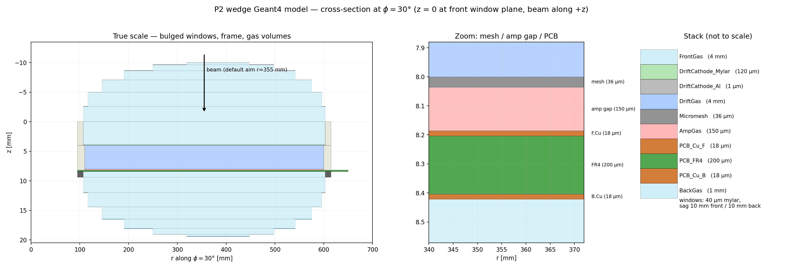
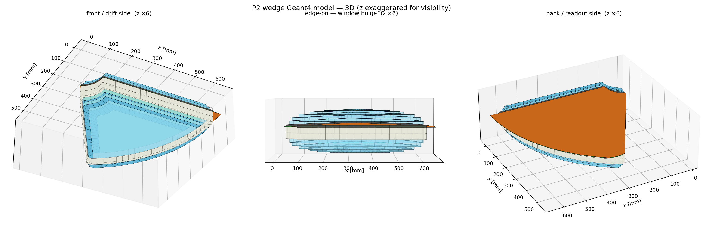
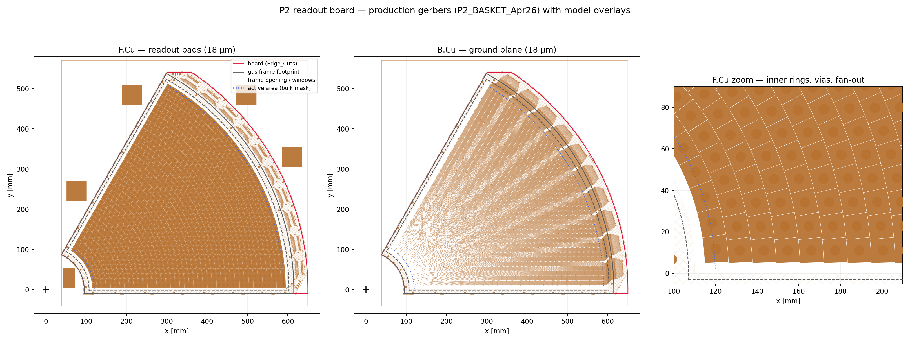
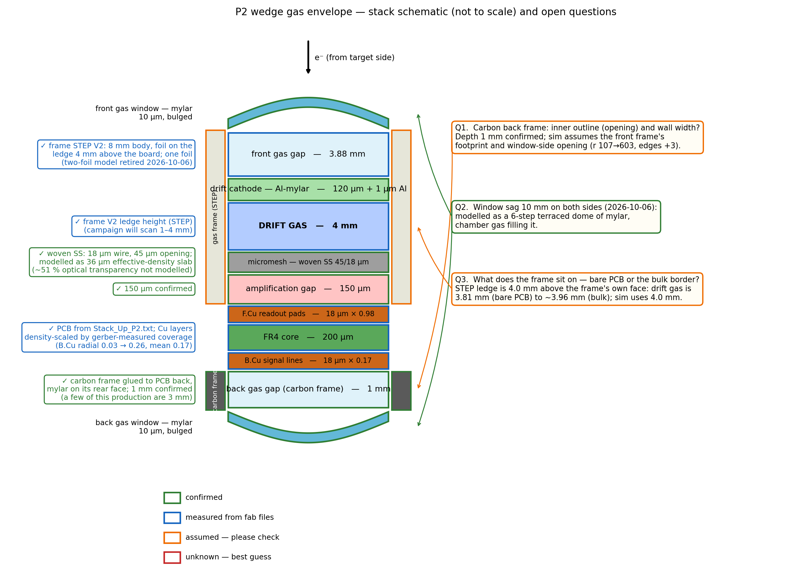

# P2 wedge — as-built Geant4 model

**Written:** 2026-08-05. Companion to [`P2_GEOMETRY.md`](P2_GEOMETRY.md) (what
the fab files say) — this file says what the **simulation actually builds**
(`-m p2`, the default mode) and, critically, **which numbers are guesses**.

Implementation: `DetectorConstruction::ConstructP2()` in
`src/DetectorConstruction.cc`, profile + constants in `include/P2Wedge.hh`,
run-time knobs in `include/SimConfig.hh` (`p2_*`) / `mm_sim` CLI.
Python mirror for plotting (kept in sync by hand): `scripts/model/p2_model.py`.

```bash
python scripts/model/plot_p2_model.py        # regenerates the figures below
```

## Coordinates

World x/y = **gerber coordinates**: the wedge apex = MESA beam axis is at
(0,0), so pad-mapping files and simulation output share one frame with no
offsets. z = 0 at the **front window plane** (top of the gas frame), +z points
downstream (beam direction). The default pencil beam aims at
(x, y) = (307.4, 177.5) mm — mid-active-area, r = 355 mm, φ = 30° — from 5 cm
upstream of the front window; move it with `--gun-x/--gun-y`.

## Stack (front → back)

| z [mm] | volume | material / thickness | source |
|---|---|---|---|
| −10.01 … 0 | `FrontWindow_*` | 10 µm mylar, bulged, sag 10 mm | **confirmed** (Alexandra 2026-10-06), as in P2Sim; bulge model below |
| 0 … 3.879 | `FrontGas` | chamber gas, 3.879 mm | frame STEP V2: top face (8.0) − ledge (4.0) − foil (0.121) |
| 3.879 | `DriftCathode_Mylar` | 120 µm mylar, one foil on the frame ledge | **confirmed** (Alexandra 2026-10-06) |
| 3.999 | `DriftCathode_Al` | 1 µm Al, facing the drift gas | **confirmed** (2026-10-06) |
| 4.0 … 8.0 | `DriftGas` *(sensitive)* | 4.0 mm | **frame V2 ledge height** (`P2_Frame_V2.0.stp`, 2026-10-06); campaign scans 1–4 mm |
| 8.0 | `Micromesh` | woven SS **45 µm opening / 18 µm wire** (pitch 63 µm) → 36 µm slab, ρ×0.224 | **confirmed** (Alexandra 2026-10-06, supersedes "48×19"); effective-density model |
| 8.036 … 8.186 | `AmpGas` *(sensitive)* | 150 µm | **confirmed** (2026-08-05, re-confirmed 2026-10-06) |
| (in AmpGas) | `Pillar`, `PillarBig` | Dynamask (PMMA-like, 1.30 g/cm³), full amp-gap height | `--pillars saclay` (default): V1 insulation mask, 12 471 × Ø0.8 mm + 5 × Ø6.15 mm, 3.80 % of the active area — det1–det4. `--pillars cern`: 41 366 × Ø0.5 mm + 5 big, 4.90 % — det5. `include/P2Pillars.hh`, generated by `scripts/gerber/extract_pillars.py` with the cosmic-bench parser |
| 8.186 … 8.422 | `PCB_Cu_F` / `PCB_FR4` / `PCB_Cu_B` | 18 µm Cu·**0.983** / 200 µm FR4 / 18 µm Cu·**0.174** | `FABRICATION_P2/Stack_Up_P2..txt` (exact, byte-identical to the repo copy); Cu coverage from the gerbers |
| 8.422 … 9.422 | `BackGas` | 1 mm | = carbon back-frame depth: **1 mm confirmed** (Alexandra 2026-10-06; a few are 3 mm, `--back-gap`) |
| 9.422 … 19.43 | `BackWindow_*` | 10 µm mylar, bulged, sag 10 mm | glued to rear face of the carbon frame (**confirmed** 2026-08-05); thickness and sag **confirmed** 2026-10-06 |
| 0 … 4.0 | `GasFrame` (ring, window side) | plastic (**confirmed**); polycarbonate assumed | STEP V2: opening r 107→603, edges +3 |
| 4.0 … 8.186 | `GasFrameLedge` (ring, board side) | plastic | STEP V2: opening r 110→600, edges +0 |
| 8.422 … 9.422 | `GasFrameBack` (ring) | carbon fiber, 1.6 g/cm³ | **confirmed carbon**, glued to PCB periphery (photos 2026-08-05); outline **assumed** = front frame footprint, window-side opening |

**The board-side ring is 4.186 mm in the model against 4.0 mm in the STEP.**
The model keeps the drift gas at the nominal 4.0 mm and stacks mesh (36 µm) +
amp gap (150 µm) under it, so the frame comes out 0.186 mm taller than the
drawing. Which is right depends on what the frame actually sits on (bare PCB
→ drift gas 3.81 mm; the bulk's ~150 µm border → ~3.96 mm). A ≤ 5 % effect on
primary ionization; `--drift-gap` covers it.

Transverse profiles (all in `P2Wedge.hh`):

- **board** (PCB layers): r 95→650 mm, edges +10 mm, top cut y ≤ 540.01 — exact from Edge_Cuts;
- **frame footprint**: r 95→615, edges +10 — `P2_Frame_V2.0.stp`, exact
  (sectioned in FreeCAD 2026-10-06; identical section at φ = 7, 17, 30, 44, 53°);
- **window-side opening** (front gas, drift foil, windows): r 107→603, edges +3 — exact;
- **board-side opening** (drift gas, mesh, amp gap): r 110→600, edges +0 — exact.
  Contains the whole active area (r 119.87→589.80, φ 0.97→59.0°).
- No profile reaches the board's y = 540 chord. Not modelled: the ~2.4 mm glue
  groove in the frame's board face, the Ø2 mm gas channel at z = 3.5 mm above
  the board, the mounting ears outside r = 615.

## Window bulge model

The few-mbar overpressure bloats the outer mylar sheets. Each window is a
**terraced dome**: N=6 stacked gas prisms whose profile shrinks about the
window centroid following a spherical-cap law (σ_k = cos(kπ/2N), height
h_k = H·sin(kπ/2N)), each step capped by a flat mylar annulus so **every
z-parallel path crosses exactly one 10 µm mylar thickness**. Oblique tracks
through terrace risers are the residual approximation error. **H = 10 mm on
both sides** (Alexandra 2026-10-06), settable with `--bulge-front/--bulge-back`.

What the sag changes in the physics: where the window mylar sits, and that
up to 10 mm of chamber gas fills each dome (`FrontWindow_Gas*`,
`BackWindow_Gas*` — scored, but outside any field, so never a signal). The
drift and amplification gaps are untouched.






## Settled 2026-08-05 (Dylan)

- **Drift gap: 3 mm baseline.** The simulation campaign will scan drift gaps
  from 4 mm (trending) down to 1 mm (`--drift-gap`) — mechanics prefers large,
  signal/noise may prefer small.
- **Amplification gap: 150 µm** (not the 128 µm bulk standard).
- **Gas: keep the current set**, `ArIso` default for now; many gases will be
  simulated later.
- **Overpressure: ~1–10 mbar**, exact value unknown → sag defaults justified
  by the Hencky estimate above.

## Settled 2026-08-05 evening (Alexandra, WhatsApp + photos)

- **Drift cathode = TWO mylar foils** "at maybe 1 mm distance", the one on
  the gas side aluminised facing the drift gas. Modelled as
  mylar / 1 mm gas / mylar+Al; window→mesh kept at the STEP-derived 8 mm, so
  the front gas gap dropped 5 → 4 mm. Foil thicknesses still guesses (12 µm
  each). The outer windows are a *different*, non-aluminised foil.
- **Mesh: woven stainless steel, "48×19 opening and pitch"** — read as
  48 µm opening / 19 µm wire (pitch 67 µm, the standard 45/18-style weave).
  Modelled as a 38 µm (2 wire Ø) slab of steel at fill fraction
  π·d/(4·pitch) ≈ 0.223, matching the woven areal mass. Optical transparency
  (48/67)² ≈ 51 % is *not* geometrically modelled.
- **Back frame = carbon**, a wedge ring glued to the PCB periphery ("no
  carbon in the active area"), back mylar glued to its rear face, then the
  whole thing integrates with the drift side. Normally **1 mm** thick, up to
  3 mm in this production ("nothing was the same") → default 1 mm,
  `--back-gap` to change. Photos in the repo owner's archive (2026-08-05).
- **Top frame:** aluminum was discussed for the top frame at one point
  (never carbon on top), but the **top gas frame is plastic** (Dylan
  follow-up) — polycarbonate assumed for the exact type.
- **B.Cu is signal lines only, not a full ground plane.**

## Settled 2026-08-05 (Dylan follow-up)

- **"Front should be 3 mm" reconciled:** the 3 mm is the frame ledge → drift
  foil distance, i.e. exactly the STEP geometry already built. No change.
- **Mesh reading confirmed:** wire Ø 19 µm, opening 48 µm.
- **Gas between the two cathode foils:** chamber gas (as modelled).
- **Back frame: assume 1 mm** for this wedge (`--back-gap` for the 3 mm ones).
- **Cu coverage measured from the gerbers**
  (`scripts/gerber/analyze_cu_coverage.py`, exact shapely union): over the
  active area **F.Cu 0.983**, **B.Cu 0.174** (radial profile 0.03 inner →
  0.26 outer as the signal lines accumulate toward the outer-arc
  connectors). Both Cu layers are now full-thickness slabs of
  density-scaled copper. A radially-dependent B.Cu density would be the next
  refinement if it ever matters.

## Still to confirm with the collaboration

One-figure summary (send this): `figures/p2_stack_questions.png`, regenerate
with `python scripts/model/plot_p2_model.py --only questions`.



Ordered roughly by impact on the physics:

1. **Carbon back frame outline** — depth 1 mm confirmed; its inner opening
   and wall width are not in any drawing here, so it borrows the front
   frame's footprint (r 95→615) and window-side opening (r 107→603, edges +3).
2. **What the frame sits on** (bare PCB or the bulk border) — sets the drift
   gas to 3.81–3.96 mm instead of the nominal 4.0 (see the stack table).

Settled 2026-10-06 (Alexandra: design files are the reference): PCB stack
from `FABRICATION_P2`, gas frame from `DRIFT_P2_261124/FRAME_4mm/P2_Frame_V2.0.stp`
(4 mm drift, 3.879 mm front gas, exact openings), mesh 45/18, amp gap 150 µm,
**one** 120 µm aluminized-mylar drift foil (replaces the two-foil model; the
old one is still available with `p2_cath_gap_mm > 0`), 10 µm outer windows,
10 mm sag both sides, 1 mm carbon back frame, and the pillars (V1 Saclay mask
by default, CERN mask for det5).
Settled earlier (2026-08-05): board outline, active area, back-frame anatomy
(carbon, glued to PCB periphery), top frame plastic, gas Ar/iC₄H₁₀ 95/5, pad
map (modulo the two-revision discrepancy, still open — handoff question 6).
